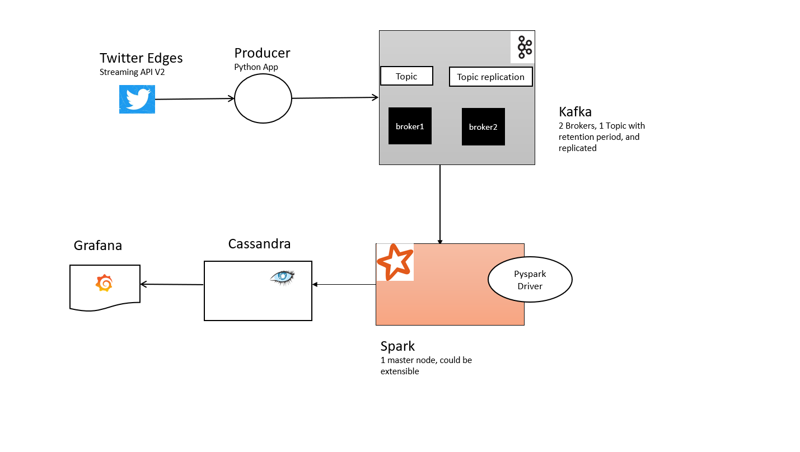
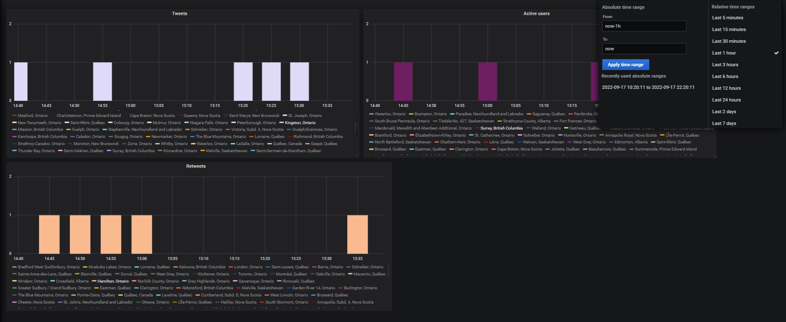

# Challenge 3 - EvilNet rules the world

***1 - Architecture***

In this architecture a container app will stream tweets using the Twitter v2 api, and will produce to a replicated kafka topic which has a time retention period to be determines.

The kafka cluster has two brokers, and two zookeepers, it's possible to use both brokers for producing to kafka and consuming from kafka (using spark). In this case the solution would be able to handle failovers, it's also possible to use each broker for a task, and we need to test using a heavy stream if any performance enhancement can come from this.

 Batch streaming will be done using 1 spark master node, it can be extensible by adding workers.

 The batch streaming is orchestrated by a "structured streaming" python app, which will stream data from kafka aggregate it and save it to Cassandra DB.

Grafana was chosen as the visualizer for its aesthetics, ease of use, and ability to integrate with most of data sources.( It has not been implemented yet)

***2 - Code***

  A. Docker-compose : a docker-compose file has been created, which upon start up will spin up the containers and run all the services.

  B. Producer: An encapsulated module was written for the purpose of streaming from twitter and producing to kafka, this can be upgraded by adding a generic filter or r                rules.
               As a future task, this module will be improved to stream and produce asynchronously by using asyncio and aiokafka.

  C. Stream processor: A python driver script has been written to run against the master spark, it will perform structured streaming from Kafka to Cassandra.
                       The aggregation count of tweets by city by time has been implement in this script, some tests are being done before proceeding to re-tweets, and                           users

 ***3 - Startup script***

 Please use ./start-all.sh, it currently contains the "docker-compose up" but further functions might be added to it.

***4 - Visualization, queries, and restrictions ***

 ***5 - Tests***

  A. Fidelity tests: It's possible to miss messages coming from twitter due to routing or networking issues.

 Twitter infra is mostly on GCP and it's preferable to deploy next to an edge there, or in a GCP datacenter.

 If Evilnet are rooting for top accuracy, It's possible to do fidelity testing by streaming twitter data from multiple cloud locations.

 The process of streaming will start at the same time on similar machines but in different locations, it will endure for a large enough window, data can be collected for comparison.

 Finally, it’s possible to collect the data and compare it, the comparison will allow us to infer which host has least missing records.

 B. Unit testing:

 C. Full testing:

  ***6 - resource footprint analysis***

  ***7- Scalability plan***
